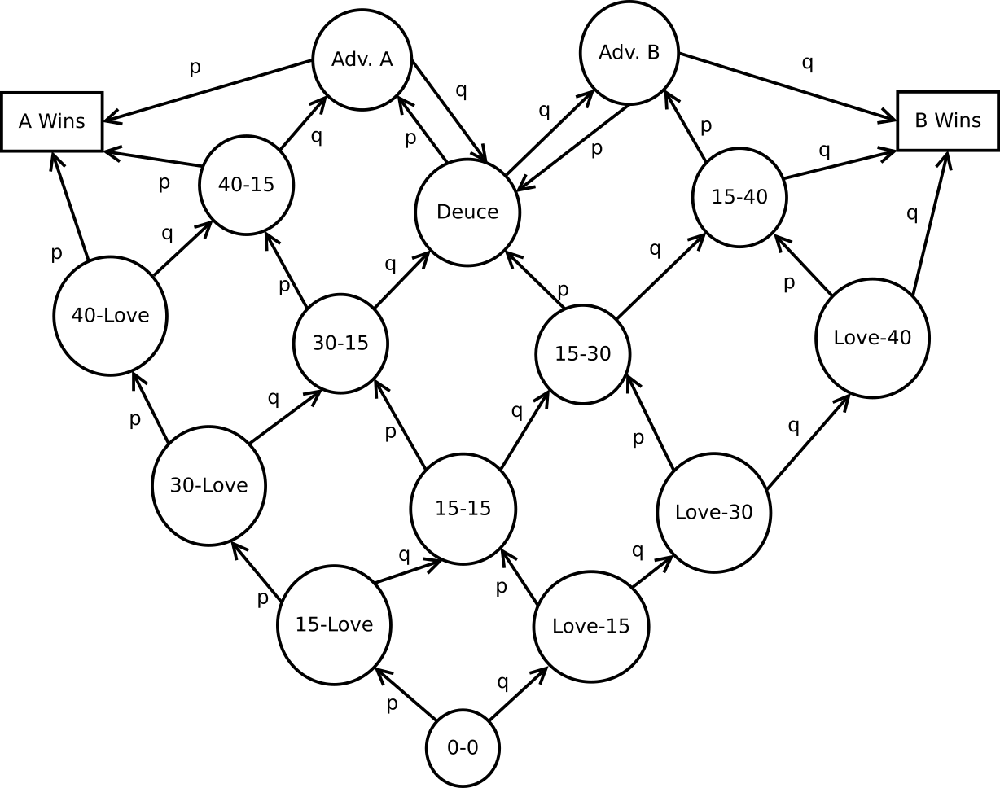

# Tênis Markoviano

Nesse trabalho, analisamos uma simulação de um jogo de tênis modelado por uma Cadeia de Markov. A imagem a seguir descreve o modelo utilizado:



## Simulação

A simulação é feita pelo script `simulate_matches.py`. É possível gerar um arquivo em formato `.csv` executando:

    python simulate_matches.py dir/para/output.csv p n

Onde `p` é a probabilidade $p$ do jogador **A** fazer um ponto (consequentemente, a probabilidade do jogador **B** fazer um ponto $q=1-p$) e `n` é o número de partidas diferentes para simular.

A simulação também pode ser executada importanto a função `simulate_matches`:

```py
from simulate_matches import simulate_matches

simulate_matches('dir/para/output', p, n)
```

O log da partida é escrito no arquivo passado fornecido. Ele tem formato `csv` e cada linha contêm as seguintes informações: `match,set,game,state,state,point`.

- `match`: o número da partida (valores de 0 a n-1);
- `set`: o número do set;
- `game`: o número do jogo (valores de 0 a 2);
- `state`: o número da jogada;
- `state`: o estado do jogo (um dos estados especificados);
- `point`: o jogador que fez ponto na jogada (`a`, `b` ou `n`, para o estado `0-0`).

Um exemplo de arquivo de saída é:

    match,set,game,play,state,point
    0,0,0,0,0-0,n
    0,0,0,1,15-love,a
    0,0,0,2,15-15,b
    0,0,0,3,15-30,b
    0,0,0,4,15-40,b
    0,0,0,5,win_b,b
    0,0,1,0,0-0,n
    0,0,1,1,15-love,a
    0,0,1,2,30-love,a
    0,0,1,3,40-love,a
    0,0,1,4,win_a,a
    0,0,2,0,0-0,n
    0,0,2,1,love-15,b
    0,0,2,2,love-30,b
    0,0,2,3,love-40,b
    0,0,2,4,15-40,a
    0,0,2,5,win_b,b

## Metodologia

Duas partidas foram simuladas com `n=50` cada. A primeira representa uma situação em que um jogador é muito melhor que o outro ($p=0.75$ e $q=0.25$). A segunda partida representa uma situação em que ambos os jogadores possuem habilidades similares ($p=0.52$ e $q=0.48$).

Para cada caso, vamos analisar:

- A probabilidade de um jogador ganhar a partida;
- A distribuição do número de sets, games

## Resultados

Os resultados podem ser vistos no notebook `trab.ipynb`. Nele, mostramos alguns comentários dos resultados, além de algum gráficos que ajudam na análise.